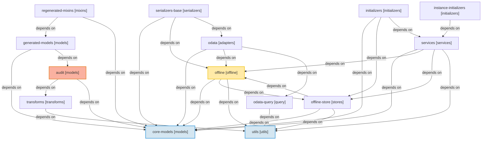

# Граф зависимостей между модулями

**Количество модулей:** 14  
**Количество файлов:** 364  
**Количество зависимостей:** 22

```mermaid
graph TD
    %% Узлы модулей без зависимостей (основа графа)
    core-models["core-models [models]"]
    utils["utils [utils]"]

    %% Модули с минимальной глубиной зависимостей
    transforms["transforms [transforms]"] -- depends on --> utils
    audit["audit [models]"] -- depends on --> transforms
    audit -- depends on --> core-models

    %% Модули с глубиной 2-3
    generated-models["generated-models [models]"] -- depends on --> core-models
    generated-models -- depends on --> audit
    regenerated-mixins["regenerated-mixins [mixins]"] -- depends on --> generated-models
    regenerated-mixins -- depends on --> core-models

    %% Модули с глубиной 3+
    services["services [services]"] -- depends on --> core-models
    services -- depends on --> offline
    services -- depends on --> offline-store
    services -- depends on --> utils
    offline["offline [offline]"] -- depends on --> core-models
    offline -- depends on --> offline-store
    offline -- depends on --> utils
    offline-store["offline-store [stores]"] -- depends on --> core-models
    offline-store -- depends on --> offline
    offline-store -- depends on --> utils

    %% Модули с глубиной 4+
    odata-query["odata-query [query]"] -- depends on --> utils
    odata["odata [adapters]"] -- depends on --> core-models
    odata -- depends on --> offline
    odata -- depends on --> odata-query
    serializers-base["serializers-base [serializers]"] -- depends on --> core-models
    serializers-base -- depends on --> offline
    serializers-base -- depends on --> odata
    initializers["initializers [initializers]"] -- depends on --> core-models
    initializers -- depends on --> offline-store
    initializers -- depends on --> services
    instance-initializers["instance-initializers [initializers]"] -- depends on --> services

    %% Стили для основных узлов
    style core-models fill:#d4e6f1,stroke:#3498db,stroke-width:2px
    style utils fill:#d4e6f1,stroke:#3498db,stroke-width:2px
    style offline fill:#ffeaa7,stroke:#f1c40f,stroke-width:2px
    style audit fill:#fab1a0,stroke:#e67e22,stroke-width:2px
```
